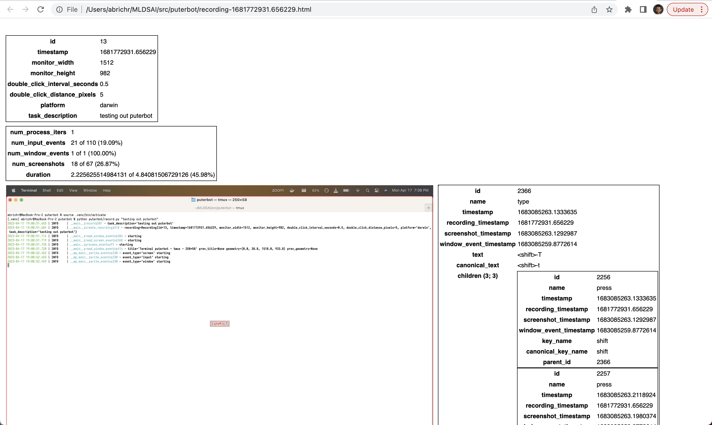

# PuterBot: GUI Process Automation with Transformers

Welcome to PuterBot: GUI Process Automation with Transformers! This library
implements AI-First Process Automation for GUI applications. It:

- Records screenshots and associated user input,
- Converts screenshots and user input into tokenized format,
- Feeds tokenized screenshots and user input into transformer models
- Converts transformer output into replayable input events

The goal is similar to that of Robotic Process Automation, except that we use
transformers instead of RPA tools.

The approach is similar to [adept.ai](https://adept.ai/), except that instead
of requiring the user to prompt the model directly, we prompt it behind the
scenes by observing the user's activities.

## Setup

```
git clone https://github.com/MLDSAI/puterbot.git
cd puterbot
python3.10 -m venv .venv
source .venv/bin/activate
pip install wheel
pip install -r requirements.txt
pip install -e .
alembic upgrade head
pytest
```

## Running

### Record

Create a new recording by running the following command:

```
python puterbot/record.py "testing out puterbot"
```

Wait until all three event writers have started:
```
| INFO     | __mp_main__:write_events:230 - event_type='screen' starting
| INFO     | __mp_main__:write_events:230 - event_type='input' starting
| INFO     | __mp_main__:write_events:230 - event_type='window' starting
```

Type a few words into the terminal and move your mouse around the screen
to generate some events, then stop the recording by pressing CTRL+C.


### Visualize

Visualize the latest recording you created by running the following command:

```
python puterbot/visualize.py
```

This will open your browser. It will look something like this:



### Playback

You can play back the recording using the following command:

```
python puterbot/replay.py NaiveReplayStrategy
```

More ReplayStrategies coming soon! (see [Contributing](#Contributing)).


## Contributing

### Problem Statement

Our goal is to automate the task described and demonstrated in a `Recording`.
That is, given a new Screenshot, we want to generate the appropriate
InputEvent(s) based on the previously recorded InputEvents in order to
accomplish the task specified in the `Recording.task_description`, while
accounting for differences in screen resolution, window size, application
behavior, etc.

### Dataset

The dataset consists of the following entities: 
1. `Recording`: Contains information about the screen dimensions, platform, and
   other metadata.
2. `InputEvent`: Represents a user input event such as a mouse click or key
   press. Each `InputEvent` has an associated `Screenshot` taken immediately
   before the event occurred. `InputEvent`s are aggregated to remove
   unnecessary events (see [visualize][#visualize].)
3. `Screenshot`: Contains the PNG data of a screenshot taken during the
   recording.
4. `WindowEvent`: Represents a window event such as a change in window title,
   position, or size.

You can assume that you have access to the following functions: 
- `get_latest_recording()`: Gets the latest recording.
- `get_events(recording)`: Returns a list of `InputEvent` objects for the given
  recording.

### Instructions

1. Fork this repository and clone it to your local machine. 
2. Get puterbot up and running by following the instructions under [Setup](#Setup).
3. Create a new file under `strategies` to contain your replay strategy. You
may base your implementation off of `naive.py`.
4. Write unit tests for your implementation.

See https://github.com/MLDSAI/puterbot/issues for ideas on where to start.

### Evaluation Criteria

Your submission will be evaluated based on the following criteria: 

1. **Functionality** : Your implementation should correctly generate the new
   `InputEvent` objects that can be replayed in order to accomplish the task in
   the original recording.

2. **Code Quality** : Your code should be well-structured, clean, and easy to
   understand.

3. **Scalability** : Your solution should be efficient and scale well with
   large datasets.

4. **Testing** : Your tests should cover various edge cases and scenarios to
   ensure the correctness of your implementation.

### Submission

1. Commit your changes to your forked repository.

2. Create a pull request to the original repository with your changes.

3. In your pull request, include a brief summary of your approach, any
   assumptions you made, and how you integrated external libraries.

4. *Bonus*: interacting with ChatGPT and/or other language transformer models
   in order to generate code and/or evaluate design decisions is encouraged. If
   you choose to do so, please include the full transcript.


## We're hiring!

If you're interested in getting paid for your work, please address one or more
of the issues labelled "Internship" (full-time hires will also be considered.)

https://github.com/MLDSAI/puterbot/issues?q=is%3Aissue+is%3Aopen+label%3AInternship

## Troubleshooting

Apple Silicon:

```
$ python puterbot/record.py
...
This process is not trusted! Input event monitoring will not be possible until it is added to accessibility clients.
```

Solution:
https://stackoverflow.com/a/69673312

```
Settings -> Security & Privacy
Click on the Privacy tab
Scroll and click on the Accessibility Row
Click the +
Navigate to /System/Applications/Utilities/ or wherever the Terminal.app is installed
Click okay.
```

## Developing

### Generate migration (after editing a model)

```
alembic revision --autogenerate -m "<msg>"
```

# Submitting an Issue

Please submit any issues to https://github.com/MLDSAI/puterbot/issues with the
following information:

- Problem description (please include any relevant console output and/or screenshots)
- Steps to reproduce (please help others to help you!)
